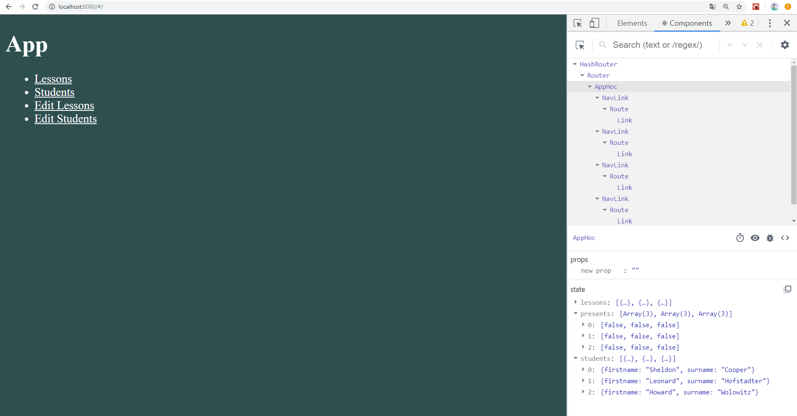

# KotlinJS 2.5
---
Компоненты высокого уровня
-----------------------------------
### 1. Начальное состояние компонента App 

### 2. Компонент Edit Elements, отвечающий за редактирование списка элементов

### 3. Компонента Edit Lesson, отвечающий за редактирование названия занятия

### 4. Состояние компонента App, после удаления Practice

### 5. Компонента Edit Student, отвечающий за редактирование имени и фамилии студента

### 6. Состояние компонента App, после добавления нового элемента в список
